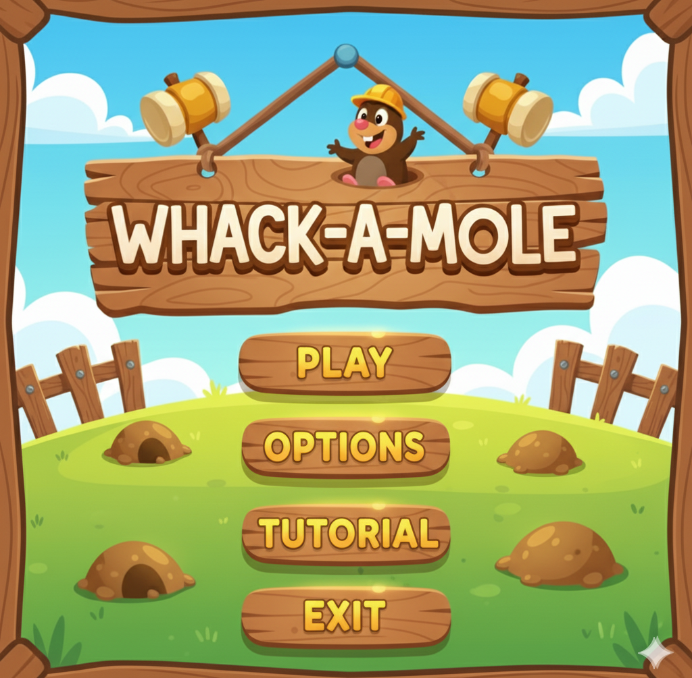
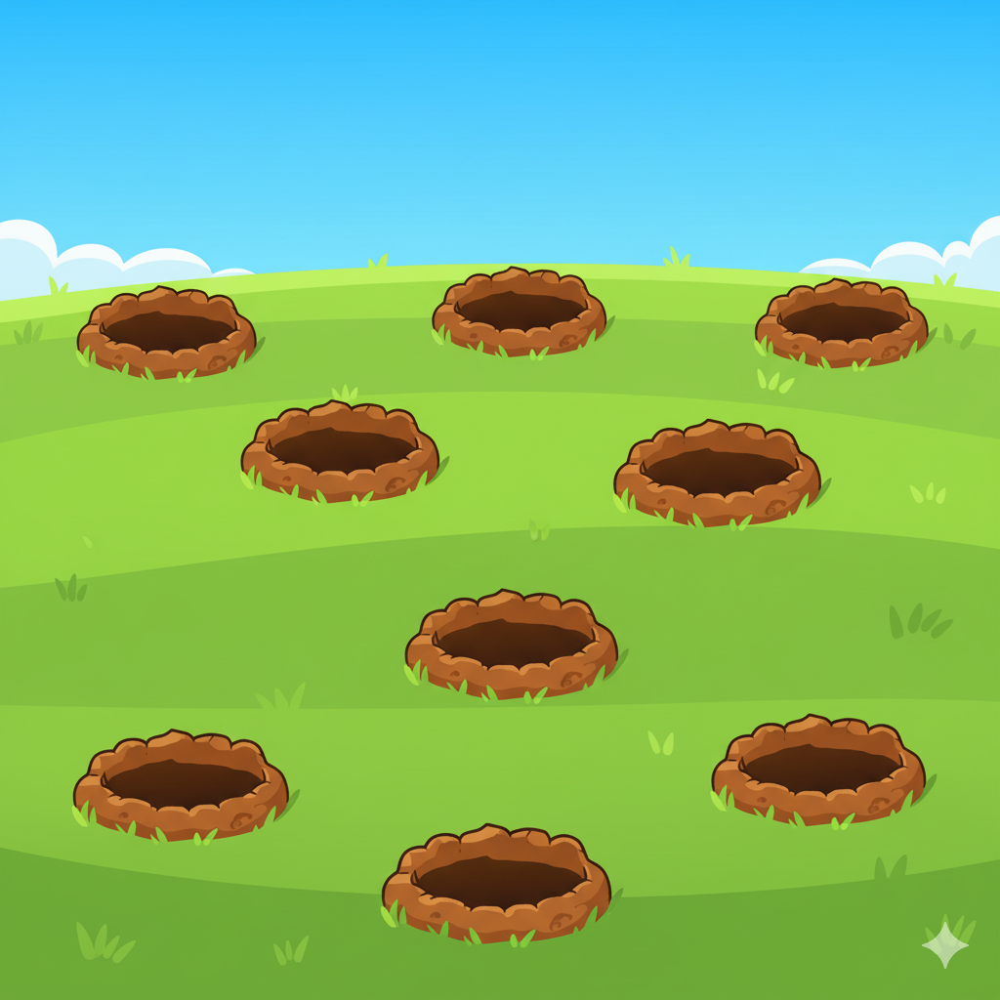

# 🐹 Capivara Whack-A-Mole


> Um jogo de reflexos rápidos estilo "Whack-A-Mole" desenvolvido em C++ com a biblioteca gráfica SFML, onde o objetivo é fazer carinho (clicar) nas capivaras antes que elas fujam!

---

## 🖼️ Screenshots

| Menu Principal | Gameplay |
|:---:|:---:|
|  |  |

---

## 🎮 Sobre o Projeto

Este projeto foi desenvolvido como parte de um curso de **Desenvolvimento de Jogos com C++ e SFML**. O objetivo principal foi aplicar conceitos fundamentais de programação de jogos, incluindo:

* **Game Loop:** Ciclo de atualização e renderização em tempo real.
* **Máquina de Estados:** Gerenciamento de telas (Menu, Jogo, Game Over, Opções).
* **Programação Orientada a Objetos:** Uso de `structs` e classes para modularizar o código.
* **Multimídia:** Manipulação de áudio (SFX e Música) e gráficos (Sprites/Texturas).
* **Matemática Vetorial:** Detecção de colisão circular e posicionamento.

---

## ✨ Funcionalidades

- [x] **3 Níveis de Dificuldade:** Fácil, Normal e Difícil (ajustando tempo e velocidade).
- [x] **Sistema de Spawn:** Aparição aleatória de capivaras nos buracos.
- [x] **Menu Interativo:** Botões com detecção de mouse e troca de cursores.
- [x] **Sistema de Áudio:** Música de fundo e efeitos sonoros de acerto.
- [x] **Feedback Visual:** Barra de tempo dinâmica que muda de cor.
- [x] **Placar de Pontuação:** Highscore da sessão atual.

---

## 🚀 Como Executar

### Pré-requisitos
* Compilador C++ (MinGW recomendado para Windows).
* Biblioteca [SFML 2.5+](https://www.sfml-dev.org/download.php) instalada.

### Rodando o Projeto (Windows)

1.  **Clone o repositório:**
    ```bash
    git clone [https://github.com/MarcosYago17/Curso-SFML-Capivara.git](https://github.com/MarcosYago17/Curso-SFML-Capivara.git)
    ```

2.  **Abra o projeto:**
    * Se estiver usando **Code::Blocks**, basta abrir o arquivo `SFML.cbp`.
    * Se estiver usando terminal, compile linkando as bibliotecas do SFML.

3.  **Execute:**
    * Certifique-se de que as `DLLs` do SFML e a pasta `assets` (imagens/sons) estejam na mesma pasta do executável.

---

## 🕹️ Controles

| Tecla / Ação | Função |
|:---:|---|
| **Mouse Esquerdo** | Clicar nos botões e nas capivaras |
| **ESC** | Voltar ao Menu Principal / Pausar |
| **Fechar Janela** | Sair do jogo |

---

